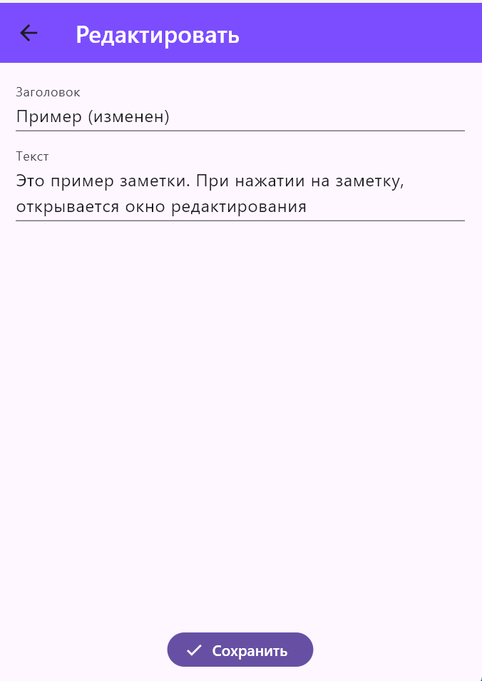

# Практическое задание № 5.
## Выполнил: Еремин Кирилл Денисович, студент группы ЭФБО-10-23

**Цели работы:**
- Научиться отображать коллекции данных с помощью ListView.builder
- Освоить базовую навигацию Navigator.push/Navigator.pop и передачу данных через конструктор
- Научиться добавлять, редактировать и удалять элементы списка без внешних пакетов и сложных архитектур

### Ход работы:
1. Модель данных для отображения заметок
lib/models/note.dart
```dart
class Note { // Создаем класс для заметок
  final String id;
  String title;
  String body;
  // Задаем требуемые параметры класса, которые будут отображаться в приложении
  Note({required this.id, required this.title, required this.body});

  Note copyWith({String? title, String? body}) =>
      Note(id: id, title: title ?? this.title, body: body ?? this.body);
}
```

2. Главный экран со списком
lib/main.dart
```dart
// Импортируем библиотеки
import 'package:flutter/material.dart';
import 'models/note.dart';
import 'edit_note_page.dart';
```
```dart
// Класс для реализации списка заметок
class _NotesPageState extends State<NotesPage> {
  final List<Note> _notes = [
    Note(id: '1', title: 'Пример', body: 'Это пример заметки'),
  ];

  final TextEditingController _searchController = TextEditingController();
  List<Note> _filteredNotes = [];
  bool _isSearching = false;

  @override
  void initState() {
    super.initState();
    _filteredNotes = _notes;
    _searchController.addListener(_filterNotes);
  }
  // Методы для реализации поля поиска
  @override
  void dispose() {
    _searchController.dispose();
    super.dispose();
  }

  void _filterNotes() {
    final query = _searchController.text.toLowerCase();
    setState(() {
      if (query.isEmpty) {
        _filteredNotes = _notes;
      } else {
        _filteredNotes = _notes
            .where((note) => note.title.toLowerCase().contains(query))
            .toList();
      }
    });
  }

  void _startSearch() {
    setState(() {
      _isSearching = true;
    });
  }

  void _stopSearch() {
    setState(() {
      _isSearching = false;
      _searchController.clear();
      _filteredNotes = _notes;
    });
  }
  // Метод добавления заметки
  Future<void> _addNote() async {
    final newNote = await Navigator.push<Note>(
      context,
      MaterialPageRoute(builder: (_) => EditNotePage()),
    );
    if (newNote != null) {
      setState(() {
        _notes.add(newNote);
        _filterNotes(); // Обновляем фильтрацию после добавления
      });
    }
  }
  // Метод редактирования заметок
  Future<void> _edit(Note note) async {
    final updated = await Navigator.push<Note>(
      context,
      MaterialPageRoute(builder: (_) => EditNotePage(existing: note)),
    );
    if (updated != null) {
      setState(() {
        final i = _notes.indexWhere((n) => n.id == updated.id);
        if (i != -1) _notes[i] = updated;
        _filterNotes(); // Обновляем фильтрацию после редактирования
      });
    }
  }
  // Метод удаления заметок
  void _delete(Note note) {
    setState(() {
      _notes.removeWhere((n) => n.id == note.id);
      _filterNotes(); // Обновляем фильтрацию после удаления
    });
    ScaffoldMessenger.of(
      context,
    ).showSnackBar(const SnackBar(content: Text('Заметка удалена')));
  }
```
```dart
// Поле поиска в AppBar
title: _isSearching
    ? TextField(
        controller: _searchController,
        autofocus: true,
        style: const TextStyle(color: Colors.white),
        decoration: const InputDecoration(
            hintText: 'Поиск по заголовку...',
            hintStyle: TextStyle(color: Colors.white70),
            border: InputBorder.none,
        ),
    )
```
```dart
body: _filteredNotes.isEmpty
    ? Center(
        child: Column(
            mainAxisAlignment: MainAxisAlignment.center,
            children: [
                // Вывод иконок
                Icon(
                    _searchController.text.isEmpty
                        ? Icons.note_add
                        : Icons.search_off,
                    size: 64,
                    color: Colors.grey.shade400,
                ),
                const SizedBox(height: 16),
                Text(
                    // Вывод надписей при отсутствии заметок
                    _searchController.text.isEmpty
                        ? 'Пока нет заметок. Нажмите +'
                        : 'Заметки не найдены',
                    style: TextStyle(
                      fontStyle: FontStyle.italic,
                      fontSize: 20,
                      color: Colors.grey.shade600,
                    ),
                ),
            ],
        ),
    )
    // Список заметок
    : ListView.builder(
        itemCount: _filteredNotes.length,
            itemBuilder: (context, i) {
                final note = _filteredNotes[i];
```
```dart
// Свайп-удаление через Dismissible
child: Dismissible(
    key: ValueKey(note.id),
    direction: DismissDirection.endToStart,
    background: Container(
        decoration: BoxDecoration(
            color: Colors.red,
            borderRadius: BorderRadius.circular(8),
        ),
        alignment: Alignment.centerRight,
        padding: const EdgeInsets.only(right: 20),
        child: const Icon(Icons.delete, color: Colors.white),
    ),
    onDismissed: (direction) {
        _delete(note);
    },
    // Вывод спсика на экран
    child: ListTile(
        title: Text(
            note.title.isEmpty ? 'Без названия' : note.title,
            style: const TextStyle(fontWeight: FontWeight.w500),
        ),
        subtitle: Text(
            note.body,
            maxLines: 1,
            overflow: TextOverflow.ellipsis,
        ),
        // Переход в режим редактирования по нажатию на заметку
        onTap: () => _edit(note),
        // Удаление по кнопке через trailing
        trailing: IconButton(
            icon: const Icon(Icons.delete_outline),
            onPressed: () => _delete(note),
        ),
        contentPadding: const EdgeInsets.symmetric(
            horizontal: 16,
            vertical: 8,
        ),
    ),
),
```

3. Экран добавления/редактирования
lib/edit_note_page.dart
```dart
// Импортируем библиотеки
import 'package:flutter/material.dart';
import 'models/note.dart';
```
```dart
  // Метод сохранения заметки
  void _save() {
    if (!_formKey.currentState!.validate()) return;
    _formKey.currentState!.save();

    final result = (widget.existing == null)
        ? Note(
            id: DateTime.now().millisecondsSinceEpoch.toString(),
            title: _title,
            body: _body,
          )
        : widget.existing!.copyWith(title: _title, body: _body);

    Navigator.pop(context, result);
  }
```
```dart
/// Поле ввода заголовка
TextFormField(
    initialValue: _title,
    decoration: const InputDecoration(labelText: 'Заголовок'),
    onSaved: (v) => _title = v!.trim(),
),
SizedBox(height: 12),
// Поле ввода текста
TextFormField(
    initialValue: _body,
    decoration: const InputDecoration(labelText: 'Текст'),
    minLines: 2,
    maxLines: 8,
    onSaved: (v) => _body = v!.trim(),
    // Проверка текста (поле не должно быть пустым)
    validator: (v) => (v == null || v.trim().isEmpty)
        ? 'Введите текст заметки'
        : null,
    ),
    Spacer(),
    // Сохранение заметки
    FilledButton.icon(
        onPressed: _save,
        icon: const Icon(Icons.check),
        label: const Text('Сохранить'),
    ),
```

### Скриншоты работы программы:
**Список**


**Создание заметки**


**Редактирование заметки**



**Удаление заметки**


## Выводы:
В ходе выполнения данного задания были освоены отображение коллекции данных через ListView.builder, базовая навигация Navigator.push/.pop, передача данных через конструктор, добавление, редактирование и удаление элементов списка без внешних пакетов и сложных архитектур.

**Однако, возникали некоторые сложности:**
- Не получилось настроить theme: ThemeData(useMaterial3: true)
- Не сразу получилось реализовать свайп-удаление
- При свайп удалении в сторону смещается только текст, а не весь контейнер заметки